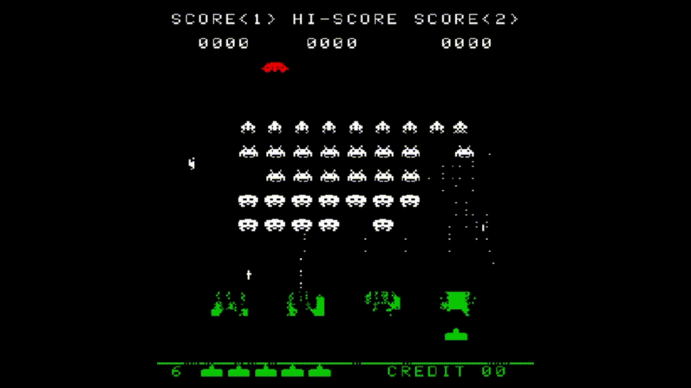

# Space Invaders (Intel 8080)

Emulates a Space Invaders arcade machine running on an Intel 8080 CPU, written in C.
Target OS is Windows 10.

# Build
The project uses a makefile to compile the C source files. 
In a windows environment, this makefile will not be usable by default. 
In order to use the makefile, you will need: 

A) Git for Windows [https://gitforwindows.org/]

B) mingw-w64 (minimum GNU for Windows 64-bit) [http://mingw-w64.org/doku.php/download/mingw-builds]

C) The GNU Make tool for 64-bit mingw (minimum GNU for Windows) [https://gist.github.com/evanwill/0207876c3243bbb6863e65ec5dc3f058] [https://sourceforge.net/projects/ezwinports/files/]

D) SDL2 (Simple DirectMedia Layer 2) 64-bit Developer Library source files (for mingw) [https://libsdl.org/download-2.0.php]

E) SDL2 Mixer 64-bit Developer Library source files (for mingw) [https://www.libsdl.org/projects/SDL_mixer/]

Build Steps:
1) Install Git for Windows. This should be straightforward.
2) Install mingw-w64 to the default Program Files path. Choose the latest version. "Architecture == x86_64" (64-bit). "threads == win32".
3) Add the 'bin' folder from your mingw-w64 install to your systems PATH environment variable. (There may be two bin folders in your install, try both)
4) Download the appropriate version of GNU make (At time of writing this would be "make-4.1-2-without-guile-w32-bin.zip")
5) Extract the contents of the zip folder.
6) Copy all contents from the extraction to your "Git\mingw64\" folder inside your Git for Windows folder path (NOT the mingw-w64 install performed at step 2)
7) In step 6, do not overwrite/replace any existing files
8) Download the SDL2 Dev Library folder to the path "C:\Program Files\mingw_dev_lib\SDL2-2.0.12" (or any folder of your choosing if you edit the makefile)
9) Download the SDL2 Mixer Library folder to to the path "C:\Program Files\mingw_dev_lib\SDL2_mixer-2.0.4" (or any folder of your choosing if you edit the makefile)
10) Run the default makefile command or execute "make emu" on a command-line

# Usage
Target display must be refreshing at 60Hz for the game to play correctly.

Use "run.sh" or directly open "bin/space_invaders_arcade.exe"

Controls:

Left Arrow -- Move left

Right Arrow -- Move right

Space bar -- Shoot

C -- Insert coin

1 -- 1-Player game start

2 -- 2-Player game start

3-0 -- Change game colour profile

D -- Dark mode toggle
# Resources
1) https://altairclone.com/downloads/manuals/8080%20Programmers%20Manual.pdf
2) http://www.nj7p.info/Manuals/PDFs/Intel/9800153B.pdfhttp://www.emulator101.com/welcome.html
3) http://computerarcheology.com/Arcade/SpaceInvaders/
4) http://www.emulator101.com/welcome.html
5) http://lazyfoo.net/tutorials/SDL/index.php

# Assumptions (for the bits that were not 100% clear during development)
1) Clock speed is 2 MHz (or 0.5μs clock period). The 8080 is capable of up to 3.125 MHz, but this was seemingly not 
the case for the Space Invaders Arcade Machine.

2) One clock period marks a CPU "state". A single instruction constitutes multiple states throughout its execution.
This is based off of information from the 8080 programmer's manual.

# Miscellaneous Notes
- Register A == 8080 "Accumulator"
- Description of how the 8080 performs subtractions is found in the programmer's manual pg. 13.
The language on this page is a bit unclear with regard to the carry bit. The programmer's manual's
description of the SUB instruction on pg. 18 clarifies this. 